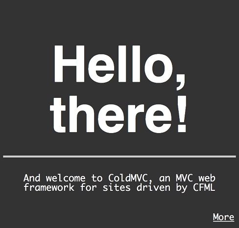
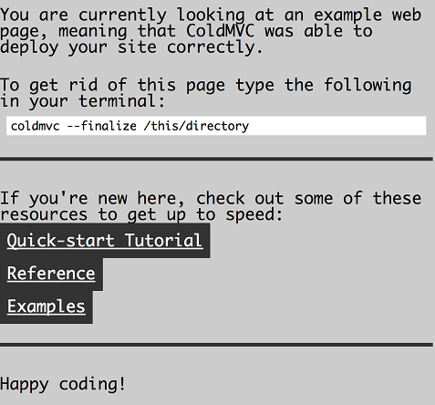

myst 
====

Summary
-------

Myst is a web framework for CFML based webservers such as ColdFusion and Lucee.
The intent is to facilitate MVC-based web development for CFML applications,
making it trivial to enforce seperation of concerns and create maintainable
CFML codebases.

Installation
------------

Myst can be downloaded via its <a href="http://mystframework.com">home page</a>
or via Github at <a href="https://github.com/zaiah-dj/myst">https://github.com/zaiah-dj/myst</a>.  You can clone the latest version by using the following on your system:

1. If you are on Linux, go to your home directory and grab the latest copy.
	<pre>
	$ cd ~
	$ git clone https://github.com/tubularmodular/myst.git
	</pre>
	
	If you do not have git installed, you may also download directly from the home page. 
	<pre>
	$ cd ~
	$ wget -O myst.tar.gz http://mystframework.com/assets/myst-v0.2.tar.gz
	$ tar xzf myst.tar.gz
	</pre>

2. Now, we can install Myst and it's accompanying files. 
	<pre>
	$ cd myst 
	$ make
	</pre>

3. Provided there were no errors, you can now run install as root (or use sudo)
	<pre>
	$ make install    # You'll probably need to be root
	</pre>

	If you decide that you don't like Myst or run into some sort of configuration
	problem, you can delete the installed files by running:
	<pre>
	$ make uninstall  # NOTE: You'll probably need to be root again
	</pre>

### Builds On

Linux only for now.  

OSX is as yet untested, and users may run into issues with Lucee.  The build process also depends on specific versions of the shell and must use Bash.

Windows is also untested, but Cygwin users may be in good shape.

Setting up your first Myst project
----------------------------------

### Introduction

For the purposes of this quick walkthrough, let's assume we want to create a
quick image gallery.  We're going to call it 'frogLookup'.

### With Embedded Tomcat

1. New projects can be setup with a one-line command sequence similar to the the following.
	<pre>
	myst --name 'frogLookup' --basedir froglookup --create --folder /path/to/coldfusion/webroot/path-of-site -n 'site-name'
	</pre>

	Notice that you will need to specify the <i>absolute</i> path to where your Lucee or ColdFusion webroot, then append the name of the directory that will hold your web files.  
	'site-name' is the symbolic name of your site, but will also be used as the title and domain name of the site if those flags are not specified.   
	After the command runs successfully, you should be able to visit a link that looks like the following (provided you have not changed the Lucee or ColdFusion default port number): 
	<a href="http://localhost:8888/froglookup">http://localhost:8888/froglookup</a>

2. At successful completion of this step your browser should look similar to the following screenshots:

<!--
	<a href="mailto:rc@tubularmodular.com?subject=Myst Setup Failed">Help!  I didn't see these images.</a>
-->

### With Apache 

....

Comprehensive Documentation
---------------------------

This README is only intended as a small demonstration of how you can get running
with Myst.   More comprehensive documentation can be found via the homepage at 
<a href="http://mystframework.com">http://mystframework.com</a>

<link href="style.css" rel="stylesheet">
